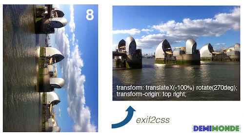

# exif2css

[](https://npmjs.org/package/exif2css)

`exif2css` Converts EXIF Orientation To CSS Transform Rules.

```sh
yarn add -E exif2css
```



## Table Of Contents

- [Table Of Contents](#table-of-contents)
- [API](#api)
- [`exif2css(orientation: number): { transform: string, transforms: Object }`](#exif2cssorientation-number--transform-string-transforms-object-)
- [Usage](#usage)
  * [As a _Node_ module:](#as-a-_node_-module)
  * [As a script:](#as-a-script)
- [Testing](#testing)
- [Copyright](#copyright)

<p align="center"><a href="#table-of-contents"></a></p>

## API

The package is available by importing its default function:

```js
import exif2css from 'exif2css'
```

<p align="center"><a href="#table-of-contents"></a></p>

## `exif2css(`<br/>&nbsp;&nbsp;`orientation: number,`<br/>`): { transform: string, transforms: Object }`

Converts an integer representing EXIF orientation into required CSS with _transfrom_ and
optionally _transform-origin_ properties. It is your job to use them as needed, possibly prefixing
the rules with browser-specific tags (e.g., `-webkit-transform` and `-webkit-transform-origin`).

One known issue is that with orientations > 4, the transformed image will have different dimensions from
its box, so that whitespace might appear on the right and at the bottom of the image.

```js
// exif2css('not-an-exif-orientation')
{}

// exif2css(1)
{}

// exif2css(2)
{
    transform: 'rotateY(180deg)',

    transforms: {
        rotateY: 180,
    },
}

// exif2css(3)
{
    transform: 'rotate(180deg)',

    transforms: {
        rotate: 180,
    },
}

// exif2css(4)
{
    transform: 'rotate(180deg) rotateY(180deg)',

    transforms: {
        rotate: 180,
        rotateY: 180,
    },
}

// exif2css(5)
{
    transform: 'rotate(270deg) rotateY(180deg)',
    'transform-origin': 'top left',

    transforms: {
        rotate: 270,
        rotateY: 180,
    },
}

// exif2css(6)
{
    transform: 'translateY(-100%) rotate(90deg)',
    'transform-origin': 'bottom left',

    transforms: {
        translateY: -1,
        rotate: 90,
    },
}

// exif2css(7)
{
    transform: 'translateY(-100%) translateX(-100%) rotate(90deg) rotateY(180deg)',
    'transform-origin': 'bottom right',

    transforms: {
        translateY: -1,
        translateX: -1,
        rotate: 90,
        rotateY: 180,
    },
}

// exif2css(8)
{
    transform: 'translateX(-100%) rotate(270deg)',
    'transform-origin': 'top right',

    transforms: {
        translateX: -1,
        rotate: 270,
    },
}
```
```

```

<p align="center"><a href="#table-of-contents"></a></p>

## Usage

You can either require this module in Node.js, or download the compiled file from _dist_ folder
and insert it on your webpage.

### As a _Node_ module:

```bash
npm i exif2css --save
```

```js
const exif2css = require('exif2css')
const css = exif2css(6)
```

### As a script:

```html

<script src="exif2css.js"></script>
<script>
    var img = document.querySelector('img')
    var orientation = 6
    var css = exif2css(orientation)

    if (css.transform) {
        img.style.transform = css.transform
    }
    if (css['transform-origin']) {
        img.style['transform-origin'] = css['transform-origin']
    }
</script>
```

<p align="center"><a href="#table-of-contents"></a></p>

## Testing

The module has been tested with _selenium-webdriver_ and _PhantomJS_ by inserting images with
specified orientation, applying generated styles from `exif2css`, taking screenshots and comparing
them against the expected image, therefore everything seems to be working properly.

<p align="center"><a href="#table-of-contents"></a></p>

## Copyright

(c) [Demimonde][1] 2019

[1]: https://demimonde.cc

<p align="center"><a href="#table-of-contents"></a></p>